# Vehicle Detection

## Goals

* Perform a feature extraction on a labeled training set of images and train a classifier Linear SVM classifier. Feature vectors include Histogram of Oriented Gradients (HOG), spatially binned color and histograms of color for a color transformed image.
* Normalize features and randomize a selection for training and testing.
* Implement a sliding-window search and use the trained classifier to search for vehicles in images.
* Run the pipeline on a video stream and create a heat map of recurring detections frame by frame to reject outliers and follow detected vehicles.
* Estimate a bounding box for detected vehicles.

## Files
 * find_cars.py - Python code to extract features, train a classifier and perform a sliding window search for cars in each frame of a video
 * svc_pickle.p - The saved LinearSVC and StandardScaler objects
 * processed_video.mp4 - The video output by find_cars.py using project_video.mp4 as input

## Training a Classifier

### The Data

The training data consists of 8800 vehicle and 8971 non-vehicle images. Each color image is saved in the PNG format and is 64x64 pixels. Examples from each class can be seen below.

| Vehicle                                       | Non-vehicle                                      |
|-----------------------------------------------|--------------------------------------------------|
| 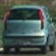   | 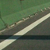   |

### Feature Extraction

After experimenting with RGB, HLS and HSV color spaces, I found that the YCrCb color space gave the best results in training a linear SVM. The first step of feature extraction was to convert the image to the YCrCb color space.

Next, I extracted the following features from each color channel:

- Histogram of Oriented Gradients (HOG: 9 orientation bins, 8 pixels per cell, 2 cells per block)
- Spatially Binned Color (32 x 32)
- Color Histogram (32 bins)

I experimented with various different parameters for HOG and spatial binning and found these values to work best in training a SVM to predict the class an image belongs to.

The results of feature extraction on each color channel of the vehicle image can be seen below:

| HOG                                                | Spatial Binning (32 x 32)                             | Color Histogram (32 bins) |
|----------------------------------------------------|-------------------------------------------------------|--|
| 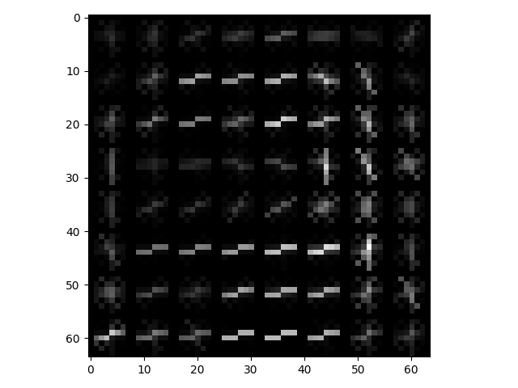   | 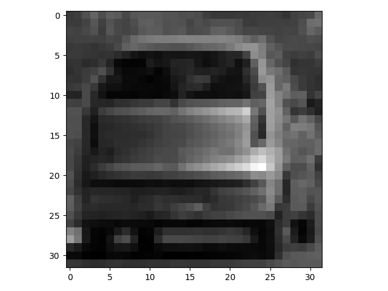   |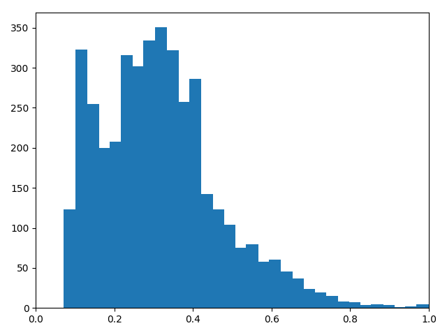   |
| 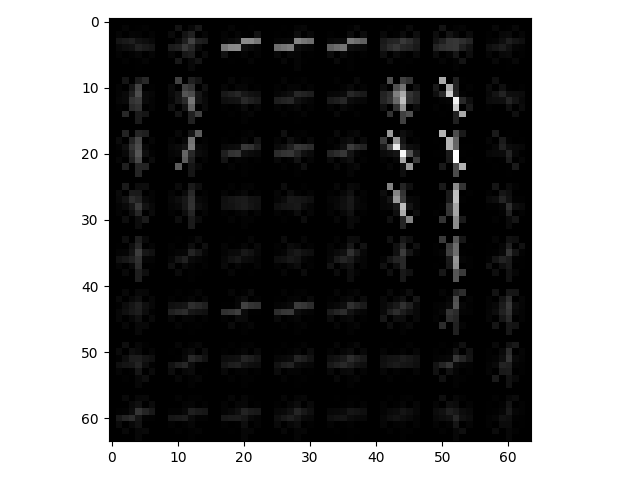   |    |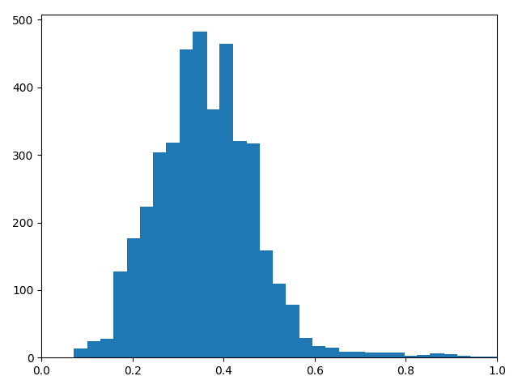   |
| 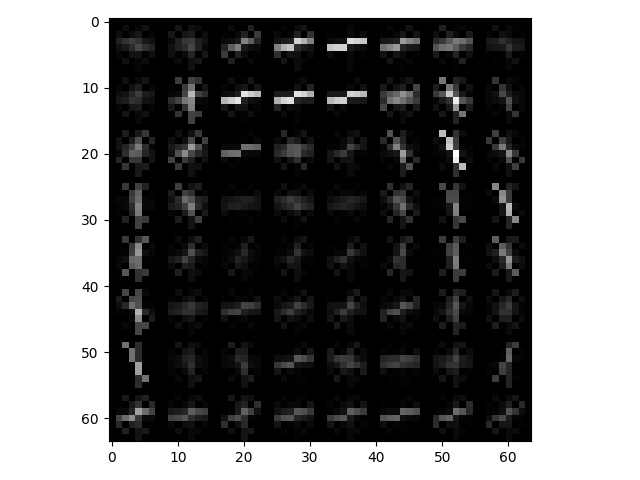   | 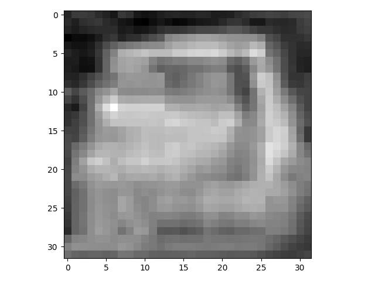   |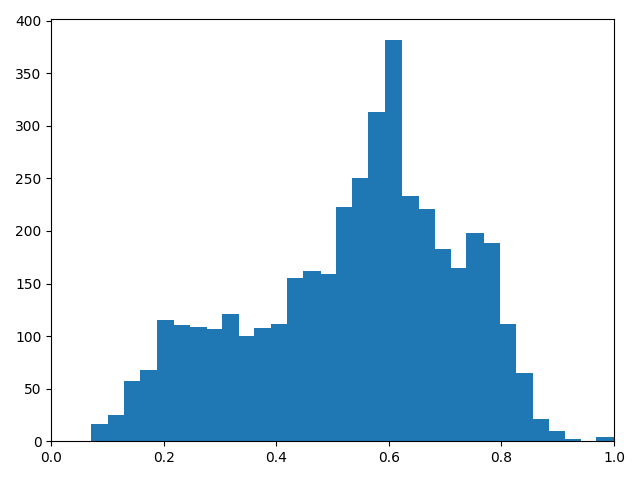   |

The results of feature extraction on each color channel of the non-vehicle image can be seen below:

| HOG                                                   | Spatial Binning (32 x 32)                                | Color Histogram (32 bins) |
|-------------------------------------------------------|----------------------------------------------------------|--|
| 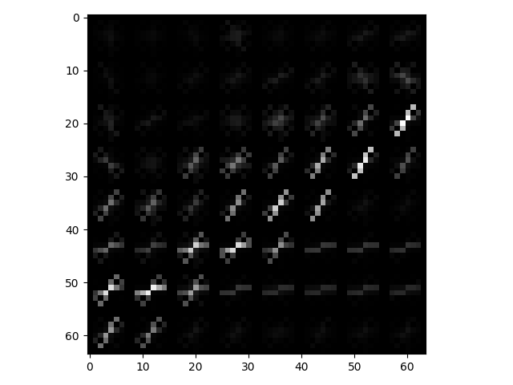   | 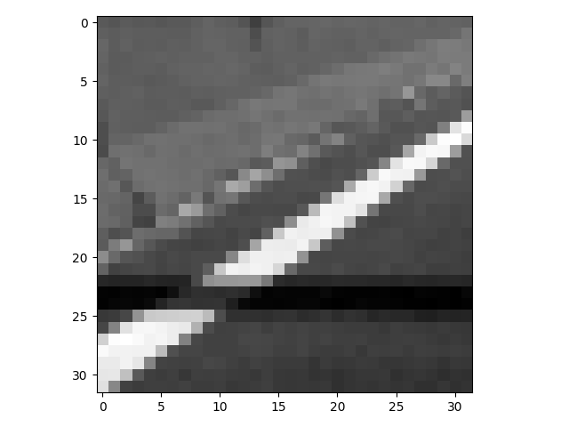   | 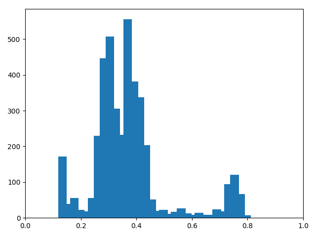   |
| 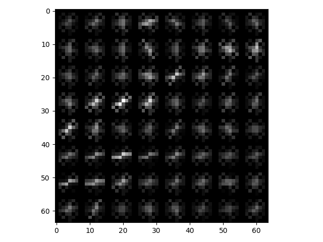   | 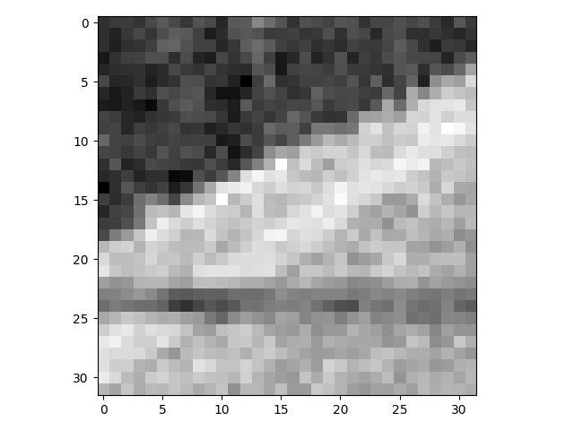   | 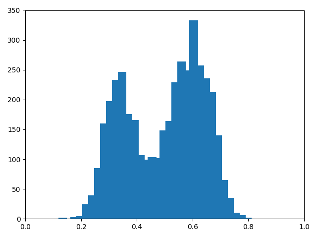   |
| 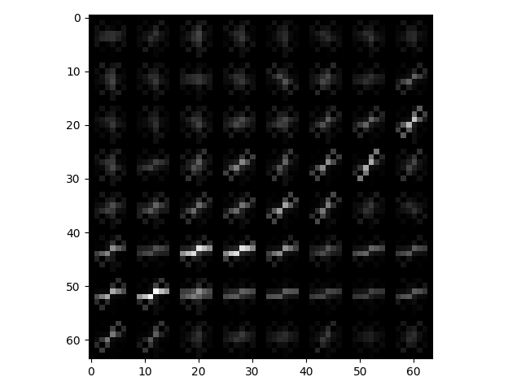   | 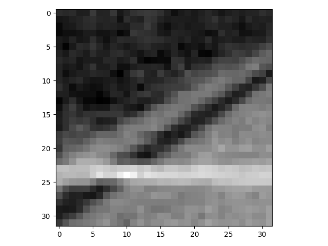   | 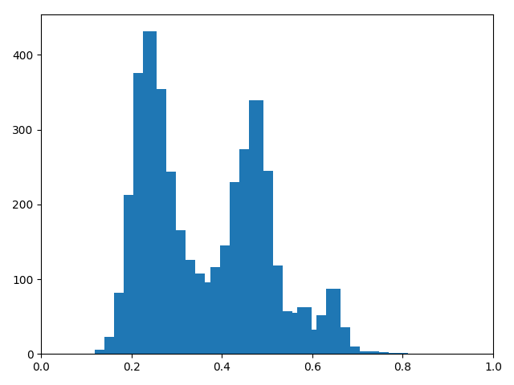   |

### Training

Prior to training, the HOG, spatial binning and color histogram for all color channels of each image were transformed into a single feature vector. This data was normalized using the sklearn.preprocessing.StandardScaler and then randomly shuffled using the sklear.utils.shuffle function. The dataset was then split into a training (80%) and test (20%) set.

A linear SVM was trained using sklearn.svm.LinearSVC. The prediction accuracy on the test set was 98%.

## Detecting Cars

To detect cars in an image, a sliding window search was performed using various window sizes and strides. An example frame from the project video is below:

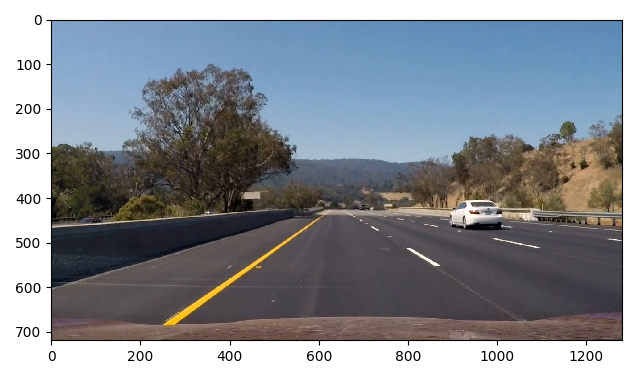

The windows and their detections for the sample frame are shown below:

| Windows (80 x 80)                           | Detections                                    |
|---------------------------------------------|-----------------------------------------------|
| 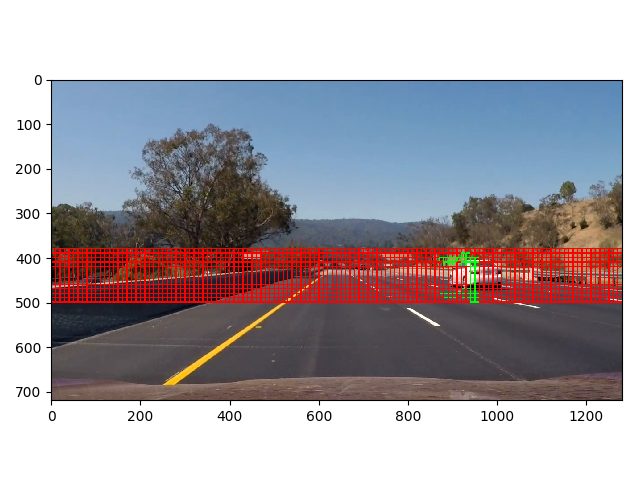   | 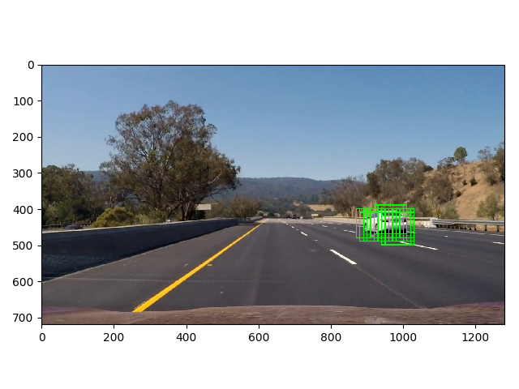   |

| Windows (108 x 108)                         | Detections                                    |
|---------------------------------------------|-----------------------------------------------|
| 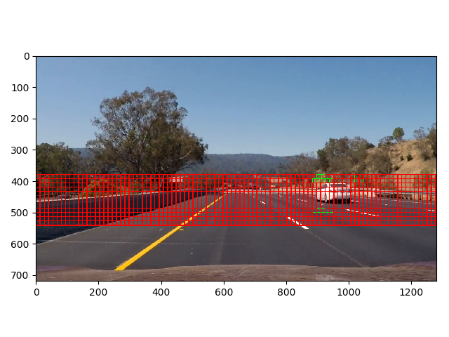   | 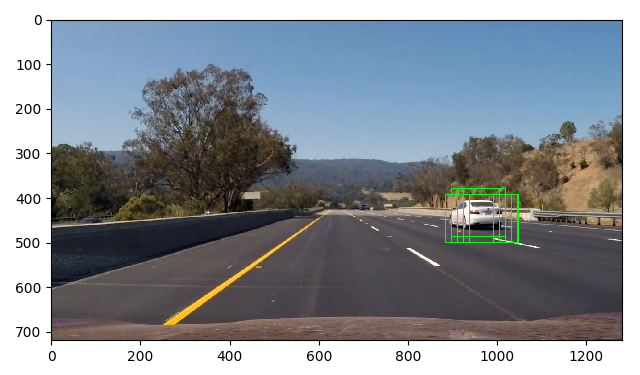   |

| Windows (128 x 128)                         | Detections                                    |
|---------------------------------------------|-----------------------------------------------|
| 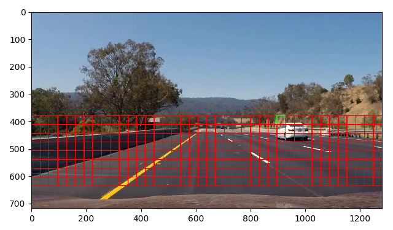   |    |

| Windows (192 x 192)                         | Detections                                    |
|---------------------------------------------|-----------------------------------------------|
| 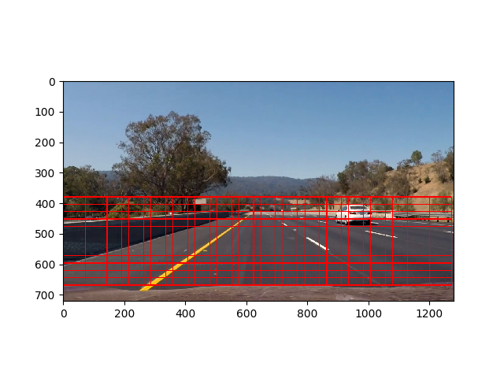   | 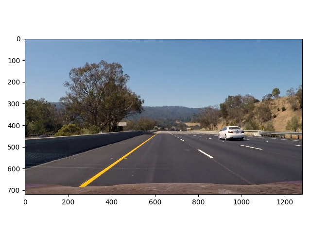   |

| Windows (256 x 256)                         | Detections                                    |
|---------------------------------------------|-----------------------------------------------|
| 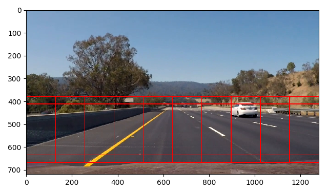   |    |

A heatmap for the detections is shown below:

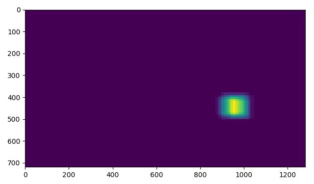

A threshold of three (3+) overlapping windows is taken and the remaining pixel values are set to one. The resulting detection is shown below:

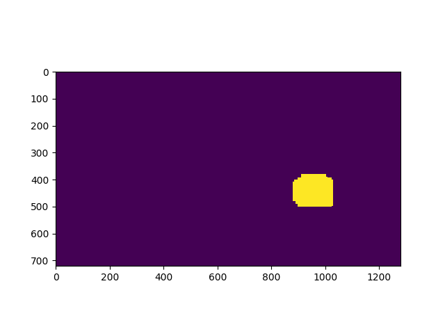

To remove false positives, the detection image is added to a circular buffer for the last ten frames. The pixel values for the frames in the buffer were summed and a threshold of eight (8+) was taken:

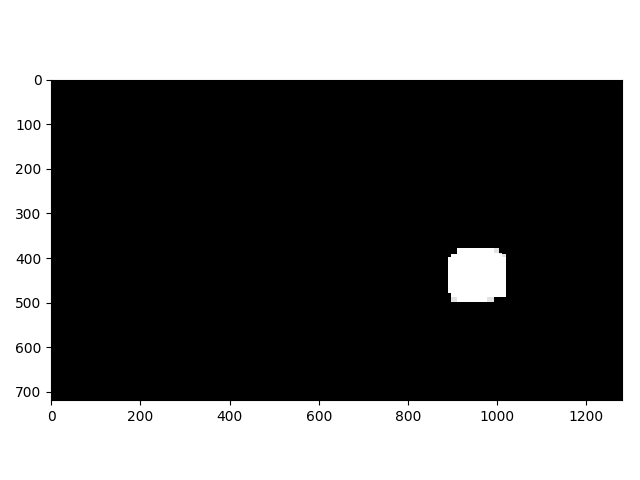

Bounding boxes for each detection were computed. Boxes with too large of a height/width or width/height ratio were discarded. The resulting detections for the sample frame can be seen below:

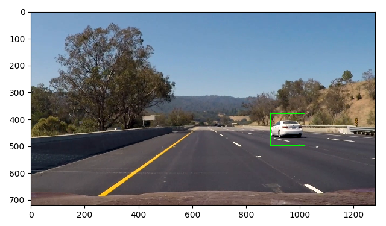

A video of vehicle detections from the project video can be found at ./processed_video.mp4.

## Conclustion

The SVM did a good job of detecting vehicles without too many false positives. One problem encountered was that the SVM had trouble detecting the white car and required me to add a large number of additional windows. These additional windows significantly increased the processing time for each frame. This pipeline would not be suitable for a real-time application. One possible solution would be to find more images of white cars and add them to the training data.

In experimentation, I found that I could have removed the color histogram to reduce processing time. It did not seem to make a significant difference in detection of vehicles.

I would have also liked to experiment more with a CNN, but I was not able to get it working as well as the SVM in the time that I had.
