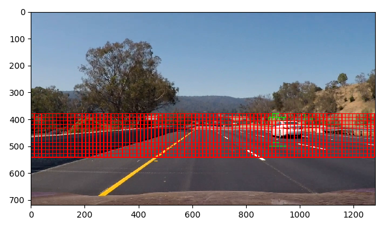
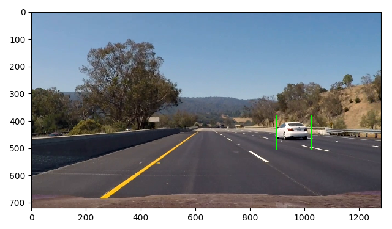
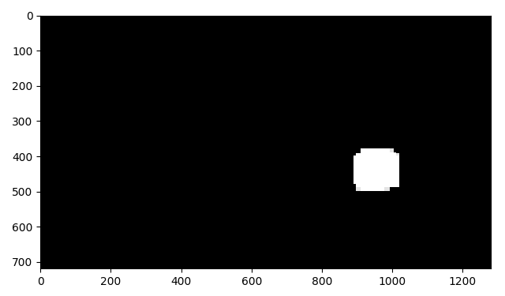

# Vehicle Detection

## Goals

* Perform a feature extraction on a labeled training set of images and train a classifier Linear SVM classifier. Feature vectors include Histogram of Oriented Gradients (HOG), spatially binned color and histograms of color for a color transformed image.
* Normalize features and randomize a selection for training and testing.
* Implement a sliding-window search and use the trained classifier to search for vehicles in images.
* Run the pipeline on a video stream and create a heat map of recurring detections frame by frame to reject outliers and follow detected vehicles.
* Estimate a bounding box for detected vehicles.

## Files
 * find_cars.py - Python code to extract features, train a classifier and perform a sliding window search for cars in each frame of a video
 * svc_pickle.p - The saved LinearSVC and StandardScaler objects
 * processed_video.mp4 - The video output by find_cars.py using project_video.mp4 as input

## Training a Classifier

### The Data

The training data consists of 8800 vehicle and 8971 non-vehicle images. Each color image is saved in the PNG format and is 64x64 pixels. Examples from each class can be seen below.

| Vehicle                                       | Non-vehicle                                      |
|-----------------------------------------------|--------------------------------------------------|
|    |    |

### Feature Extraction

After experimenting with RGB, HLS and HSV color spaces, I found that the YCrCb color space gave the best results in training a linear SVM. The first step of feature extraction was to convert the image to the YCrCb color space.

Next, I extracted the following features from each color channel:

- Histogram of Oriented Gradients (HOG: 9 orientation bins, 8 pixels per cell, 2 cells per block)
- Spatially Binned Color (32 x 32)
- Color Histogram (32 bins)

I experimented with various different parameters for HOG and spatial binning and found these values to work best in training a SVM to predict the class an image belongs to.

The results of feature extraction on each color channel of the vehicle image can be seen below:

| HOG                                                | Spatial Binning (32 x 32)                             | Color Histogram (32 bins) |
|----------------------------------------------------|-------------------------------------------------------|--|
|    |    |   |
|    |    |   |
|    |    |   |

The results of feature extraction on each color channel of the non-vehicle image can be seen below:

| HOG                                                   | Spatial Binning (32 x 32)                                | Color Histogram (32 bins) |
|-------------------------------------------------------|----------------------------------------------------------|--|
|    |    |    |
|    |    |    |
|    |    |    |

### Training

Prior to training, the HOG, spatial binning and color histograms for all color channels were transformed into a single feature vector. This data was normalized using the sklearn.preprocessing.StandardScaler and then randomly shuffled using the sklear.utils.shuffle function. The dataset was then split into a training (80%) and test (20%) set.

A linear SVM was trained using sklearn.svm.LinearSVC. The prediction accuracy on the test set was 98%.

## Detecting Cars

| Windows (80 x 80)                           | Detections                                    |
|---------------------------------------------|-----------------------------------------------|
|    |    |

| Windows (108 x 108)                         | Detections                                    |
|---------------------------------------------|-----------------------------------------------|
|    |    |

| Windows (128 x 128)                         | Detections                                    |
|---------------------------------------------|-----------------------------------------------|
|    |    |

| Windows (192 x 192)                         | Detections                                    |
|---------------------------------------------|-----------------------------------------------|
|    |    |

| Windows (256 x 256)                         | Detections                                    |
|---------------------------------------------|-----------------------------------------------|
|    |    |

Here are links to the labeled data for [vehicle](https://s3.amazonaws.com/udacity-sdc/Vehicle_Tracking/vehicles.zip) and [non-vehicle](https://s3.amazonaws.com/udacity-sdc/Vehicle_Tracking/non-vehicles.zip) examples to train your classifier.  These example images come from a combination of the [GTI vehicle image database](http://www.gti.ssr.upm.es/data/Vehicle_database.html), the [KITTI vision benchmark suite](http://www.cvlibs.net/datasets/kitti/), and examples extracted from the project video itself.   You are welcome and encouraged to take advantage of the recently released [Udacity labeled dataset](https://github.com/udacity/self-driving-car/tree/master/annotations) to augment your training data.  

Some example images for testing your pipeline on single frames are located in the `test_images` folder.  To help the reviewer examine your work, please save examples of the output from each stage of your pipeline in the folder called `ouput_images`, and include them in your writeup for the project by describing what each image shows.    The video called `project_video.mp4` is the video your pipeline should work well on.  

**As an optional challenge** Once you have a working pipeline for vehicle detection, add in your lane-finding algorithm from the last project to do simultaneous lane-finding and vehicle detection!

**If you're feeling ambitious** (also totally optional though), don't stop there!  We encourage you to go out and take video of your own, and show us how you would implement this project on a new video!

## How to write a README
A well written README file can enhance your project and portfolio.  Develop your abilities to create professional README files by completing [this free course](https://www.udacity.com/course/writing-readmes--ud777).

